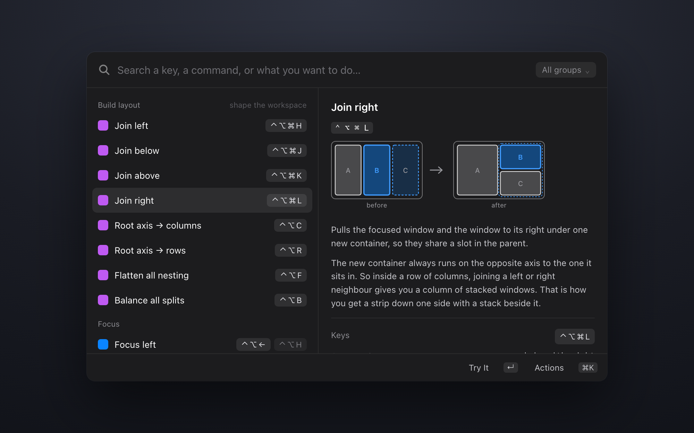
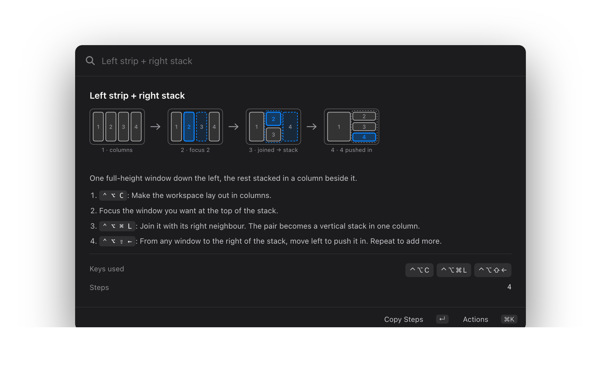

<div align="center">


# AeroSpace Cheatsheet

**Look up, learn, and run your [AeroSpace](https://nikitabobko.github.io/AeroSpace/) keybindings, from Raycast.**

[](https://github.com/nathenmcvittie/aerospace-cheatsheet/actions/workflows/test.yml)
[](LICENSE)
[](https://raycast.com)
[](https://nikitabobko.github.io/AeroSpace/)



</div>

It reads your own `aerospace.toml`. Every key it shows is a key you actually have, so it
works the same whether you run the defaults, a config you inherited from someone, or
your own bindings.

## Commands

| Command | What it does |
|---|---|
| AeroSpace Cheatsheet | Your bindings, grouped and named, with diagrams and recipes |
| Go to Workspace | Switch workspace, showing which apps are on each |
| Switch Windows | Every window grouped by workspace: focus it, pull it here, tile or float it |
| Move Window to Workspace | Send the focused window somewhere, creating the workspace if the name is new |
| Bring Workspace to This Display | Pull a workspace onto the screen you are looking at |
| Toggle AeroSpace | Pause or resume tiling, for screen sharing or an app that fights it |
| Reload AeroSpace Config | Re-read `aerospace.toml`, checking it parses first |
| Show AeroSpace Config | The raw `toml`, syntax-highlighted, with a jump to your editor |
| AeroSpace Menu Bar | Current workspace plus common layout actions |

## The cheatsheet

**Readable names.** A row says "Send window to workspace 1–9", not
`move-node-to-workspace 1`. The raw command is still there in the detail panel when
you want it.

**Real key glyphs.** `ctrl-alt-cmd-l` renders as `⌃ ⌥ ⌘ L`, thin-spaced so the
modifiers don't smear together, and reordered into macOS order. `alt-ctrl-a` and
`ctrl-alt-a` both come out as `⌃ ⌥ A`.

**Less to read.** A config is mostly repetition: arrows and `hjkl` on the same command,
a nine-long run of workspace switches, mirrored `±50` resizes. Three rules collapse it.

| Rule | Example | Becomes |
|---|---|---|
| One command, several keys | `ctrl-alt-left` and `ctrl-alt-h` | one row, second key muted |
| Mirrored pair | `resize width -50` / `+50` | `Width −50 / +50` |
| Numeric run | `workspace 1` … `workspace 9` | `⌃ ⌥ 1–9` |

A typical config goes from 66 bindings to 37 rows.

**Search that finds things.** Every row carries its keys, its command, and plain words
for what it does. Searching `stack`, `⌘L`, `ctrl-alt-cmd-l`, or `join` all reach the
same row.

**Run it from Raycast.** Press return on any row to run that command against the
window you were last in. Handy when you want to see what a binding does before
committing it to muscle memory.

**Diagrams.** Rows that change the window layout show a small before-and-after picture
of what happens on screen. Useful for the ones that are hard to hold in your head, like
why joining a left or right neighbour produces a vertically stacked column.

**Recipes.** Short walkthroughs for shapes you want on screen: a strip down one side
with a stack beside it, a 2×2 grid, even columns, or a reset back to a clean workspace.
Each step names the key from your config.

<div align="center">

</div>

**Nothing gets hidden.** A binding the extension doesn't recognise still appears, under
"Other", showing its raw command.

**Edit without leaving Raycast.** `⌘E` on any row opens a two-field form for that
binding's key and command; `⌘N` adds a new one. Saving rewrites the single line in your
`aerospace.toml` and leaves every other byte alone, comments and column alignment
included. The change is re-parsed, then applied with `reload-config`, and if AeroSpace
rejects it your config is restored exactly as it was.

## Working from your config

Every row is matched by AeroSpace *command*, never by keystroke, which is what lets the
same dictionary describe anyone's setup. Diagrams contain no key glyphs for the same
reason: they are layout schematics, and the keystroke is drawn next to them from your
config rather than baked into the picture.

Recipes are resolved the same way. If a recipe needs a command you have not bound to
anything, the step says so instead of printing a key that does nothing.

### A note on editing

Edits are made line by line on the raw text, never by parsing the file and writing it
back out. A round-trip through a TOML serialiser produces a valid file that has thrown
away every comment, blank line and hand-aligned column, which for a config people write
and annotate by hand is a destructive thing to do quietly.

If your config is a symlink (a dotfiles repo, say) the write follows it, so edits land
in the real file and show up in that repo as changes.

## Install

Until this is on the Raycast store:

```sh
git clone https://github.com/nathenmcvittie/aerospace-cheatsheet
cd aerospace-cheatsheet
npm install
npm run dev
```

`npm run dev` builds the extension and loads it into Raycast, then watches for changes.
The commands appear in Raycast straight away. Stopping the process leaves them
installed until Raycast restarts.

Requires [AeroSpace](https://nikitabobko.github.io/AeroSpace/) and a config at
`~/.aerospace.toml` or `~/.config/aerospace/aerospace.toml`.

## Development

```sh
npm run dev        # build and load into Raycast, with hot reload
npm run build      # build and typecheck
npm run diagrams   # regenerate assets/diagrams
npm run icon       # regenerate assets/icon.png
npm run screenshots # regenerate metadata/ store screenshots
npm run test       # unit and edge-case suite
npm run lint       # package validation, ESLint, Prettier
```

Tests cover the pure logic in `src/lib`: key parsing, the three merge rules, recipe
resolution, and the invariants that matter most — no binding is ever lost, row ids stay
unique, output is deterministic, and no interpolation placeholder or `undefined` can
reach a string the user reads.

Diagrams and the icon are both generated rather than drawn. To change the diagram
palette, edit `PAL` in `tools/gen-diagrams.mjs` and re-run `npm run diagrams`; all 42
SVGs re-emit. Each diagram ships as a light and a dark file, and Raycast picks between
them by the `@dark` filename suffix.

Store screenshots in `metadata/` are generated too. The generator bundles the
extension's own row-building code and feeds it a fixture config, so a screenshot
cannot drift from what the extension renders, and it uses invented bindings and app
names so nothing from a real machine ends up in the repo. It needs a Chromium-based
browser installed, and writes 2000x1250 PNGs with transparent backgrounds.

To teach the cheatsheet a command it does not know yet, add an entry to `ENTRIES` in
`src/lib/dictionary.ts`. An entry is a regex against the command plus a label, a group,
and optionally a diagram and an explanation.

## Prior art

[limonkufu/aerospace](https://www.raycast.com/limonkufu/aerospace) covers similar
ground and is where this started. The workspace and window commands do much the same
job, and its three window actions are carried over here. The cheatsheet is where this
one goes further: grouping, the merge rules, search terms, diagrams, recipes, and names
instead of raw command strings.

Two ideas came from unpublished extensions worth crediting.
[bblmian/raycast-aerospace-control-center](https://github.com/bblmian/raycast-aerospace-control-center)
has the toggle and reload commands.
[enengee/raycast-aerospace](https://github.com/enengee/raycast-aerospace) has moving a
window to a workspace that does not exist yet, and summoning a workspace to the current
display.

## Licence

MIT. See [LICENSE](LICENSE).
